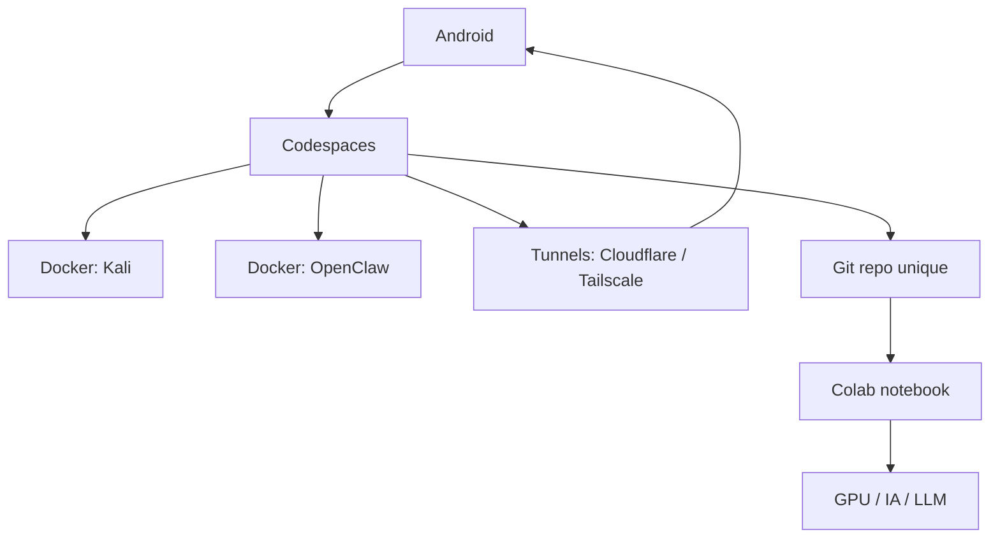

# Cloud PC Hybrid

Base Linux principale dans GitHub Codespaces, calcul GPU/RAM ponctuel dans Google Colab, avec un service OpenClaw dédié et Kaggle pour les jeux de données.

Commence par [quickstart.md](quickstart.md).

## Architecture



## Arborescence

```text
cloud-pc-hybrid/
  README.md
  .env.example
  .gitignore
  docker-compose.yml
  .devcontainer/
    devcontainer.json
    Dockerfile
  colab/
    cloud_pc_colab.ipynb
  docker/
    Dockerfile
    openclaw.Dockerfile
    entrypoint.sh
  scripts/
    compose.sh
    bootstrap.sh
    start-codespaces.sh
    start-colab.sh
    start-cloudflare.sh
    start-openclaw.sh
    start-tailscale.sh
    start-tunnel.sh
    start-vnc.sh
  start.sh
```

## Rôle des couches

- `Codespaces`: machine Linux principale, persistante, terminal, Docker, VS Code web
- `Docker Kali`: environnement reproductible pour les outils Linux/Kali
- `Docker OpenClaw`: service d’automatisation séparé
- `Tunnels`: accès distant stable
- `Colab`: GPU/RAM temporaire pour IA/LLM et tâches lourdes
- `Kaggle`: récupération de datasets et notebooks data

## Démarrage

### 1. Démarrer Codespaces

1. Ouvrir le repo dans GitHub.
2. Créer un Codespace.
3. Laisser le bootstrap finir.
4. Copier la config:

```bash
cp .env.example .env
```

5. Renseigner `CLOUDFLARE_TUNNEL_TOKEN` dans `.env`.
6. Lancer la pile locale:

```bash
make start
```

7. Voir les logs centralisés:

```bash
make logs
```

8. Voir OpenClaw:

```bash
make logs-openclaw
```

9. Voir le log VNC si besoin:

```bash
make logs-vnc
```

### 2. Démarrer Colab

1. Ouvrir `colab/cloud_pc_colab.ipynb`.
2. Exécuter les cellules de haut en bas.
3. Utiliser Colab uniquement pour le GPU/RAM, l’IA et les travaux ponctuels.

### 3. Démarrage plus verbeux

```bash
DEBUG=1 make start
```

## Kaggle

Le bootstrap installe `kaggle` via `pip`.

Place tes identifiants ici:

```text
./.kaggle/kaggle.json
```

Puis utilise:

```bash
export KAGGLE_CONFIG_DIR="$PWD/.kaggle"
kaggle datasets list
```

## OpenClaw

Le service OpenClaw tourne dans son propre conteneur et la configuration locale se génère automatiquement au démarrage.

```bash
make openclaw
make openclaw-init
make openclaw-up
make logs-openclaw
```

Le port par défaut est `18789`.

## Tunnels

Choisis un seul provider à la fois.

### Cloudflare

```bash
export CLOUDFLARE_TUNNEL_TOKEN=...
make start
```

Cloudflare démarre automatiquement quand `CLOUDFLARE_TUNNEL_TOKEN` est présent. Sans token, le tunnel est désactivé.

### Tailscale

> Tailscale suppose que le binaire `tailscale` est déjà installé et authentifié sur l’hôte.

```bash
export TUNNEL_PROVIDER=tailscale
export TAILSCALE_MODE=serve
export TAILSCALE_TARGET=localhost:18789
make start
```

## Commandes utiles

```bash
make start
make logs
make logs-openclaw
make vnc
make tunnel
make logs-vnc
make logs-tunnel
```

## Philosophie

- Un seul repo
- Un bootstrap commun
- Des entrées séparées par environnement
- Pas de gros desktop dans Colab au premier boot
- Kaggle reste un ajout léger et utile pour les datasets
