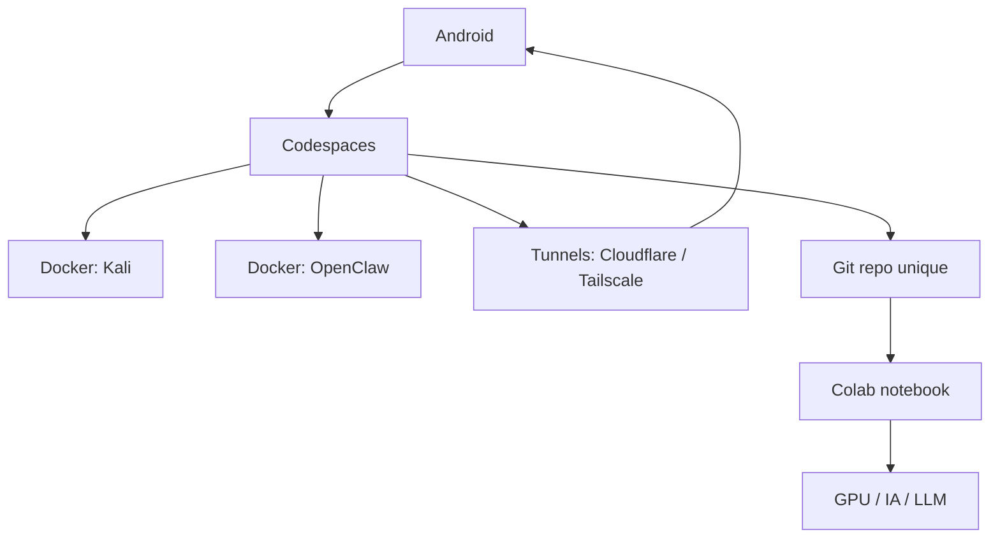

# Cloud PC Hybrid

Base Linux principale dans GitHub Codespaces, calcul GPU/RAM ponctuel dans Google Colab, avec un service OpenClaw dédié et Kaggle pour les jeux de données.

## Architecture



## Arborescence

```text
cloud-pc-hybrid/
  README.md
  .env.example
  .gitignore
  docker-compose.yml
  .devcontainer/
    devcontainer.json
    Dockerfile
  colab/
    cloud_pc_colab.ipynb
  docker/
    Dockerfile
    openclaw.Dockerfile
    entrypoint.sh
  scripts/
    bootstrap.sh
    start-codespaces.sh
    start-colab.sh
    start-openclaw.sh
    start-vnc.sh
```

## Rôle des couches

- `Codespaces`: machine Linux principale, persistante, terminal, Docker, VS Code web
- `Docker Kali`: environnement reproductible pour les outils Linux/Kali
- `Docker OpenClaw`: service d’automatisation séparé
- `Tunnels`: accès distant stable
- `Colab`: GPU/RAM temporaire pour IA/LLM et tâches lourdes
- `Kaggle`: récupération de datasets et notebooks data

## Démarrage

### 1. Initialiser le repo local

```bash
git init
git branch -M main
```

### 2. Démarrer Codespaces

1. Ouvrir le repo dans GitHub.
2. Créer un Codespace.
3. Laisser le bootstrap finir.
4. Lancer la pile locale:

```bash
docker compose up -d kali openclaw
```

5. Voir les logs OpenClaw:

```bash
docker compose logs -f openclaw
```

6. Ouvrir le bureau VNC si besoin:

```bash
bash scripts/start-vnc.sh
```

### 3. Démarrer Colab

1. Ouvrir `colab/cloud_pc_colab.ipynb`.
2. Exécuter les cellules de haut en bas.
3. Utiliser Colab uniquement pour le GPU/RAM, l’IA et les travaux ponctuels.

## Kaggle

Le bootstrap installe `kaggle` via `pip`.

Place tes identifiants ici:

```text
./.kaggle/kaggle.json
```

Puis utilise:

```bash
export KAGGLE_CONFIG_DIR="$PWD/.kaggle"
kaggle datasets list
```

## OpenClaw

Le service OpenClaw tourne dans son propre conteneur.

```bash
docker compose up -d openclaw
docker compose logs -f openclaw
```

Le port par défaut est `18789`.

## Commandes utiles

```bash
git init
docker compose up -d kali openclaw
docker compose logs -f openclaw
bash scripts/start-vnc.sh
```

## Philosophie

- Un seul repo
- Un bootstrap commun
- Des entrées séparées par environnement
- Pas de gros desktop dans Colab au premier boot
- Kaggle reste un ajout léger et utile pour les datasets
